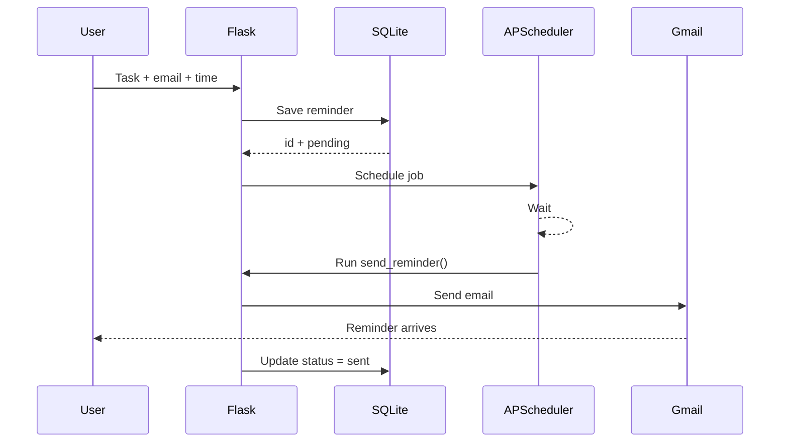

# ⏰ Python Email Reminder Automation

> A beginner-friendly automation project that turns **task + email + time** into an automatic reminder email.

This repository is built to be understood visually before you worry about the code.

---

## ✨ What you are building

You type:

```text
Task: Submit assignment
Email: you@gmail.com
Time: 8:00 PM
```

The app does this:

```text
Form
  ↓
Flask
  ↓
SQLite
  ↓
APScheduler waits
  ↓
Time arrives
  ↓
Python sends Gmail
  ↓
Status = sent
```

That is the whole project.

---

## 📸 The final idea

```mermaid
flowchart LR
    A[User fills form] --> B[Flask receives data]
    B --> C[(SQLite saves reminder)]
    C --> D[APScheduler schedules job]
    D --> E{Time reached?}
    E -- No --> D
    E -- Yes --> F[send_reminder()]
    F --> G[Gmail SMTP]
    G --> H[Reminder email arrives]
    H --> I[(Status = sent)]
```

---

## 🧠 What each tool does

| Tool | Job | Simple explanation |
|---|---|---|
| Python | Brain | Runs the logic |
| Flask | Website | Shows the form and receives user input |
| SQLite | Memory | Saves reminders |
| APScheduler | Clock | Runs code at a future time |
| Gmail SMTP | Delivery | Sends the email |

---

# 🚀 Quick start

## 1. Install Python

Check that Python works:

```bash
python --version
```

If your computer uses `python3` instead:

```bash
python3 --version
```

---

## 2. Download this repository

### Option A: GitHub

```bash
git clone https://github.com/YOUR_USERNAME/python-email-reminder-automation.git
cd python-email-reminder-automation
```

### Option B: ZIP

Download the repository as a ZIP, extract it, then open the folder in VS Code.

---

## 3. Create a virtual environment

### Windows

```bash
python -m venv venv
venv\Scripts\activate
```

### macOS / Linux

```bash
python3 -m venv venv
source venv/bin/activate
```

When it works, you should see something like:

```text
(venv)
```

at the beginning of your terminal line.

---

## 4. Install the packages

```bash
pip install -r requirements.txt
```

We only need:

- Flask
- APScheduler
- python-dotenv

---

# 📧 Gmail setup

## Why we use an App Password

Do **not** put your normal Gmail password in this project.

For eligible Google accounts, create an **App Password** and use that instead.

The idea is:

```text
Your normal Gmail password ❌

A separate app-specific password ✅
```

---

## Create your `.env`

Copy:

```text
.env.example
```

and rename the copy to:

```text
.env
```

Then fill it in:

```env
EMAIL_ADDRESS=your_email@gmail.com
EMAIL_PASSWORD=your_google_app_password
FLASK_SECRET_KEY=some_random_secret_string
```

### Important

Never upload `.env` to GitHub.

This repo already includes:

```text
.env
```

inside `.gitignore`.

---

# ▶️ Run the app

```bash
python app.py
```

Open:

```text
http://127.0.0.1:5000
```

in your browser.

You should see the reminder form.

---

# 🧪 Your first test

Do not create a reminder for tomorrow yet.

Create one for **2 minutes from now**.

Example:

```text
Task:
Test my reminder app

Email:
your-email@gmail.com

Time:
2 minutes from now
```

Click:

```text
Create Reminder
```

The website should show:

```text
status: pending
```

When the time arrives:

```text
pending
   ↓
send_reminder()
   ↓
Gmail
   ↓
sent
```

Refresh the page.

You should now see:

```text
status: sent
```

And the email should be in your inbox.

---

# 🏗️ Project structure

```text
python-email-reminder-automation/
│
├── app.py
│
├── requirements.txt
│
├── .env.example
│
├── .gitignore
│
├── README.md
│
│
├── templates/
│   └── index.html
│
└── static/
    └── style.css
```

After you run it, Python also creates:

```text
reminders.db
```

That is your SQLite database.

---

# 🔍 How the app works

## Step 1: The user fills the form

The form collects only three things:

```text
task
email
remind_at
```

Example:

```text
Submit assignment
you@gmail.com
2026-09-25 20:00
```

---

## Step 2: Flask receives the form

Inside `app.py`:

```python
task = request.form.get("task", "").strip()
email = request.form.get("email", "").strip()
remind_at = request.form.get("remind_at", "").strip()
```

Think of this as Flask saying:

> “Give me what the user typed.”

---

## Step 3: SQLite saves it

The app creates a table called:

```text
reminders
```

It looks roughly like this:

| id | task | email | remind_at | status |
|---:|---|---|---|---|
| 1 | Submit assignment | you@gmail.com | 2026-09-25T20:00 | pending |

The important status is:

```text
pending
```

That means:

> “This reminder has not been sent yet.”

---

## Step 4: APScheduler waits

The app registers a future job:

```python
scheduler.add_job(
    send_reminder,
    trigger="date",
    run_date=run_time,
)
```

Simple translation:

```text
At this exact time,
run send_reminder().
```

That is the automation.

---

## Step 5: Python sends the email

When the time arrives:

```python
send_reminder(reminder_id)
```

runs automatically.

Python connects to:

```text
smtp.gmail.com
```

and sends the message.

---

## Step 6: Status changes

Before:

```text
pending
```

After a successful email:

```text
sent
```

If something breaks:

```text
failed
```

If the computer was turned off and the reminder time passed:

```text
missed
```

---

# 🗃️ Understanding the database

SQLite is perfect for a beginner project because there is no database server to install.

Everything lives inside one file:

```text
reminders.db
```

Think of it like an Excel sheet that Python can query.

The app uses:

```sql
INSERT
```

to save a new reminder.

```sql
SELECT
```

to read reminders.

```sql
UPDATE
```

to change:

```text
pending → sent
```

And:

```sql
DELETE
```

to remove reminders.

---

# 🔁 What happens if you restart the app?

This project includes reminder recovery.

When the app starts:

```text
Start app
   ↓
Open SQLite
   ↓
Find pending reminders
   ↓
Are they still in the future?
   ↓
Yes → put them back into APScheduler
```

If the reminder time already passed while the app was offline:

```text
status = missed
```

This is better than silently pretending the reminder was sent.

---

# 🔐 Security rules

## Never do this

```python
EMAIL_PASSWORD = "my-real-password"
```

inside your code.

## Do this instead

Store secrets inside:

```text
.env
```

and read them using:

```python
os.getenv(...)
```

Also:

- Never commit `.env`
- Never paste your App Password in screenshots
- Revoke the App Password if you accidentally publish it
- Use this project for your own testing, not bulk email

---

# 🧯 Common errors + fixes

## `ModuleNotFoundError: No module named 'flask'`

Your virtual environment is probably not active.

Activate it, then:

```bash
pip install -r requirements.txt
```

---

## Gmail login fails

Check:

```text
EMAIL_ADDRESS
EMAIL_PASSWORD
```

inside `.env`.

Make sure you are using the app-specific password you created, not your normal Gmail password.

Then stop and restart Python.

---

## Reminder stays `pending`

Check:

1. Is `python app.py` still running?
2. Did you choose a future time?
3. Is your computer asleep?
4. Are your `.env` values correct?

The local version only runs while your Python process is alive.

---

## Reminder says `missed`

That means the reminder time passed while the application was not running.

Create a new future reminder and keep the app running.

---

## Port 5000 is already in use

Another app may already be using the port.

Stop the old Flask process with:

```text
Ctrl + C
```

Then try again.

---

## Email is in Spam

For a test project, Gmail may occasionally place automated messages in another folder.

Check:

- Inbox
- Spam
- Promotions

---

# 🌍 Why this is not yet a 24/7 production app

Right now:

```text
Your laptop = server
```

So:

```text
Laptop on + Python running → automation works
Laptop off → automation cannot run
```

That is expected.

For a production version, you would move the scheduler and app to a server that runs continuously.

---

# 🔥 Upgrade ideas

Once the beginner version works, try these one at a time.

## Level 1

- Edit reminders
- Better success messages
- Search reminders
- Filter pending/sent reminders
- Dark mode

## Level 2

- Recurring reminders
- “Every day at 8 PM”
- “Every Monday”
- Multiple recipients
- HTML email templates

## Level 3

- User accounts
- Login system
- Each user sees only their own reminders
- PostgreSQL instead of SQLite
- Time-zone support

## Level 4

- Deploy online
- Separate background worker
- Queue system
- Retry failed emails
- Email delivery logs
- REST API
- Mobile-friendly PWA

---

# 🧩 Recurring reminder idea

Future version:

```text
Drink water
Every day
8:00 PM
```

Instead of:

```python
trigger="date"
```

you would use a recurring trigger.

That turns this small project into a real scheduling system.

---

# 🧠 What you learn from one tiny project

This is why this project is useful.

You touch five major development concepts:

```text
1. Frontend forms
2. Backend with Flask
3. Database with SQLite
4. Background scheduling
5. Email automation
```

And underneath that, you also practice:

- Python functions
- Routes
- HTTP GET/POST
- HTML
- CSS
- SQL
- Environment variables
- Error handling
- Background jobs
- Status tracking

---

# 🗺️ Mental model

If the code ever feels confusing, come back to this:

```text
COLLECT IT
Task + email + time

      ↓

SAVE IT
SQLite → pending

      ↓

WAIT FOR IT
APScheduler

      ↓

SEND IT
Python → Gmail

      ↓

MARK IT
pending → sent
```

You do not need a more complicated mental model than that.

---

# ✅ Beginner checklist

Before saying “it works”, test all of these:

- [ ] The homepage opens
- [ ] I can create a reminder
- [ ] The reminder appears in the list
- [ ] The status starts as `pending`
- [ ] The email arrives
- [ ] The status becomes `sent`
- [ ] I can delete a reminder
- [ ] Restarting the app restores future pending reminders
- [ ] `.env` is not tracked by Git
- [ ] No password appears inside `app.py`

---

# 💡 Suggested portfolio description

You can describe this project like this:

> Built a Flask-based email reminder automation app using Python, SQLite and APScheduler. Users can schedule reminders through a web form; reminders are persisted in SQLite, restored after app restarts, and automatically delivered by email at the scheduled time.

---

# 📌 Suggested GitHub repository name

```text
python-email-reminder-automation
```

Suggested description:

```text
A beginner-friendly Flask + SQLite + APScheduler project that sends scheduled email reminders automatically.
```

---

# 🤝 Make it yours

Good beginner projects become good portfolio projects when you change them.

Try changing:

- UI
- Email wording
- Reminder statuses
- Features
- Database fields
- Scheduling rules

Then add your own screenshots to this README.

---

## Final architecture



---

# 🎯 The whole project in one sentence

**Collect the reminder, save it, wait for the time, send the email.**

